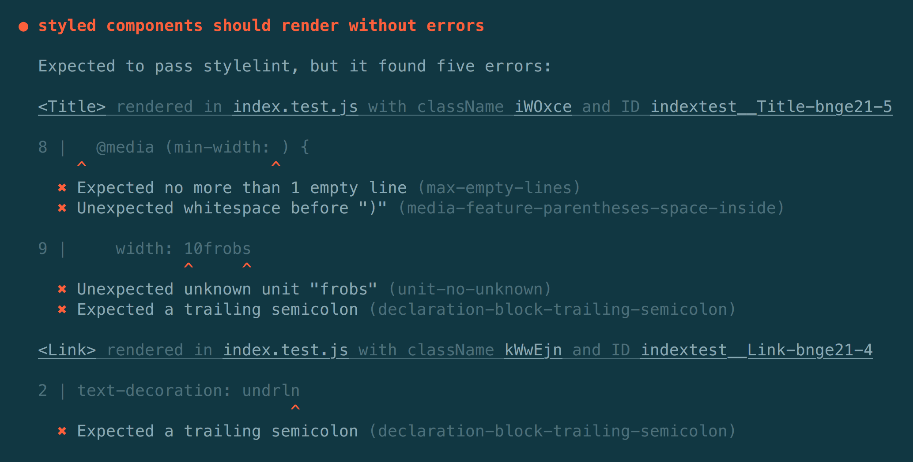

# jest-styled-components-stylelint

A helper for running stylelint on your styled-components styles **at runtime**.

That means it lints the styles _after_ all your dynamic interpolations are
resolved! So it doesn’t get tripped up by them or need annotations, and will
more accurately reflect the styles you’re actually shipping.



## Usage

In a Jest setup file like `setupTestFramework.js`:

```js
import configure from 'jest-styled-components-stylelint'

// NOTE: This should be configured before `styled-components` and `stylis` are
// imported anywhere!
configure({
  failOnError: true,
  formatter: 'string'
})
```

Then in your tests, just make sure something renders your components:

```js
import TestRenderer from 'react-test-renderer'

test('renders successfully', () => {
  const wrapper = TestRenderer.create(<Button />)
  expect(wrapper.toJSON()).toMatchSnapshot()
})
```

Any stylelint errors will cause the test to fail – or if `failOnError` is
`false`, they will simply be logged.

### Options

#### failOnError

Whether there should be an automatic assertion at the end of every test (added
via `afterEach`) that asserts there were no stylelint errors when running the
test.

If `true`, stylelint errors will cause the test to fail. The failure message
will include the formatted lint errors.

If `false`, stylelint errors will be logged to stderr but the test won’t fail.

Default: `true`

#### More…

All remaining options are passed along to [stylelint’s `lint()` function][lint].
The `formatter` option defaults to `string`.

[lint]: https://github.com/stylelint/stylelint/blob/master/docs/user-guide/node-api.md#options
